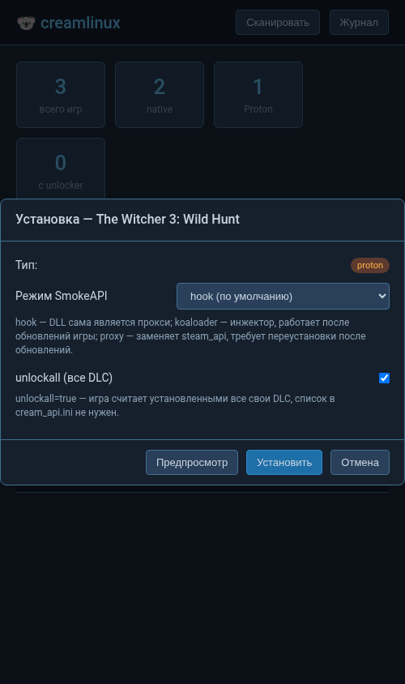

# Creamlinux
Клон CreamAPI для Linux.

После того как 20PercentRendered заархивировал оригинальный репозиторий, я решил форкнуть проект и поддерживать его по мере возможностей.

**English version: [README.md](README.md)**

## Наш вклад (отличия от апстрима)
Этот форк (gongarn/creamlinux) добавляет поверх anticitizn/creamlinux следующее:

- **Поддержка современных интерфейсов Steam SDK** — SteamApps v009, SteamUser
  v022/v023, SteamClient v021-v023 (апстрим перехватывал только v008/v021/v017-019,
  поэтому свежие игры вроде CK3 не показывали DLC); заголовки Steam обновлены до
  SDK 1.65 с корректными раздельными vtable-обёртками для каждой версии
  интерфейса
- **Хуки flat API** (`SteamAPI_ISteamApps_*`, `SteamAPI_ISteamUser_*`) — чинят
  игры на Unity/Steamworks.NET (например, Dead Cells), которые вызывают flat API
  напрямую; заодно исправлен 32-битный баг со стеком в старом хуке
  BGetDLCDataByIndex
- **`unlockall = true`** — разблокировка всех DLC, которые знает игра, без
  какого-либо списка ID; секция `[dlc]` становится необязательной
- **`tools/update-dlc.py`** — автоматическая загрузка списков DLC из Steam Store
  API (ручной поиск ID больше не нужен)
- **`tools/setup.py`** — установщик в одну команду: автоопределение native/Proton
  игр, установка creamlinux или SmokeAPI (режимы hook/koaloader/proxy),
  `--scan`/`--install`/`--uninstall`, `--dry-run`
- **Веб-интерфейс** (`tools/gui.py`) — локальное веб-приложение: таблица игр,
  установка/удаление, редактор ini, обновление DLC с живым логом
- **Исправления надёжности** — cream.sh работает из любой рабочей директории
  (#62), поддержка MangoHud (#51), прелоад только нужной разрядности (чистые
  логи, #71), `CREAM_CONFIG_PATH` принимает и файл, и директорию
- **CI и качество** — современные workflows (еженедельная автосинхронизация
  `cream_api.ini`, автоматические релизы), юнит-тесты подключены к ctest, код
  разбит на модули (src/), удалён мёртвый код

## Возможности
- Разблокирует DLC из списка `cream_api.ini` для нативных Linux-игр Steam (Proton/Wine не поддерживается)
- Поддержка современных интерфейсов Steam SDK: **ISteamApps v008/v009**, **SteamUser v020-v023**, **SteamClient v017-v023**
- Хуки **flat API** (`SteamAPI_ISteamApps_*`, `SteamAPI_ISteamUser_*`), используемого играми на Unity/Steamworks.NET
- `cream_api.ini` автоматически синхронизируется с апстримом каждую неделю через CI

## Поддержка
Creamlinux *должен* работать с большинством Steam-игр. Он не работает с Proton или Wine — для них используйте SmokeAPI или другие аналоги, созданные специально для Windows.
Следующие игры протестированы и точно работают:

 - Stellaris
 - Hearts Of Iron IV
 - Europa Universalis IV
 - Crusader Kings II
 - Crusader Kings III
 - Victoria 3
 - PAYDAY 2

## Неподдерживаемые игры
Следующие игры протестированы и пока не работают с creamlinux — можете попробовать альтернативы, перечисленные внизу:
- Cities Skylines 2
- European Truck Simulator / American Truck Simulator

## Установка
Самый простой способ — приложение **Tickbase**: https://github.com/Novattz/creamlinux-installer
Оно автоматически скачивает и настраивает creamlinux для выбранных Steam-игр, а также подбирает все ID DLC. Помните: вам всё равно понадобятся актуальные **файлы DLC** в папке игры. Установщик и creamlinux **не** скачивают контент автоматически. Запускать установщик нужно заново при выходе новых DLC.

Альтернатива — встроенный помощник установки (Python 3, без зависимостей):
```
python3 tools/setup.py --scan          # список установленных Steam-игр и их статус
python3 tools/setup.py --install 394360  # установить анлокер для игры
python3 tools/setup.py --dir /путь/к/игре
```
Он автоматически определяет тип игры:
- **нативная Linux-игра** → устанавливает creamlinux (файлы берутся из локальной
  сборки или последнего релиза) и выводит launch options
- **Windows-игра в Proton** → устанавливает [SmokeAPI](https://github.com/acidicoala/SmokeAPI)
  (Windows-анлокер) в папку игры + общий `cream_api.ini`; launch options не нужны
- `--scan` находит все установленные Steam-игры (в любых библиотеках) и показывает
  тип native/Proton и статус анлокера
- `--smokeapi-mode hook|koaloader|proxy` — выбор метода установки для Proton:
  `hook` (по умолчанию, сама DLL является прокси), `koaloader` (инжектор,
  переживает обновления игры) или `proxy` (заменяет steam_api dll, максимально
  надёжно, но требует переустановки после обновлений)
- `--update-dlc <appid>` — обновить список DLC, `--dry-run` — предпросмотр

Если скрипт не подходит, можно установить creamlinux вручную. Имейте в виду: `cream_api.ini` придётся обновлять вручную, добавляя ID DLC для ваших игр.

## Ручная установка
0. Вам понадобятся актуальные **файлы DLC** в папке игры. Creamlinux **не** скачивает ничего автоматически
1. Скачайте [последний релиз](https://github.com/gongarn/creamlinux/releases/latest/download/creamlinux.zip)
2. Распакуйте и скопируйте файлы в папку игры
3. В настройках запуска игры в Steam укажите `sh ./cream.sh %command%`
4. Запускайте игру!

Список «поддерживаемых» DLC хранится в `cream_api.ini`. Если хотите протестировать новую игру или вышло новое DLC — добавьте записи вручную.

### Разблокировка всего без списка DLC
Установите `unlockall = true` в секции `[config]` файла `cream_api.ini` — и все DLC,
которые знает игра, будут считаться установленными; список `[dlc]` не нужен
(хотя он полезен, если хотите контролировать, какие именно DLC показывать).

`logging = false` в `[config]` отключает вывод логов creamlinux (по умолчанию они пишутся в stderr).

### Добавление новой игры (автозагрузка DLC)
Вместо ручного поиска ID используйте встроенный помощник:
```
python3 tools/update-dlc.py 394360 --output package/cream_api.ini
```
Он запрашивает список DLC игры через Steam Store API, получает названия и
добавляет их в секцию `[dlc]` — существующие записи и комментарии сохраняются.
`--dry-run` — предпросмотр, `--refresh-names` — обновление названий уже
известных ID, можно передать несколько appid за раз.

Если что-то не работает — смотрите раздел «Решение проблем» ниже.

## Веб-интерфейс
Для графического интерфейса запустите:
```
python3 tools/gui.py
```
Он поднимет локальное веб-приложение на `http://127.0.0.1:8765` и откроет браузер
(домен и интернет не нужны — всё работает на вашей машине). Интерфейс показывает
все установленные Steam-игры с типом и статусом анлокера, позволяет
устанавливать/удалять анлокеры, переключать режимы SmokeAPI, редактировать
`cream_api.ini` (unlockall, logging, список DLC) и обновлять списки DLC из
Steam Store с живым логом.



## Сборка из исходников
0. Установите зависимости:
- Ubuntu: `build-essential` `gcc-multilib` `g++-multilib` `cmake` `git`
- Arch: `base-devel` `multilib-devel` `cmake` `git`

1. Клонируйте проект:
```
git clone https://github.com/gongarn/creamlinux
```
2. Соберите:
```
sh ./build.sh
```
3. Скопируйте содержимое папки `output` в папку игры
4. В настройках запуска игры в Steam укажите `sh ./cream.sh %command%`

Либо, если установлен Docker, просто выполните `docker compose up`

# Решение проблем
## Красные треугольники у DLC
Это нормально. DLC всё равно должны работать.


## MangoHud не работает с creamlinux
Используйте префикс `mangohud` в launch options: `sh ./cream.sh mangohud %command%`.
Скрипт сам выставит `MANGOHUD=1` / `MANGOHUD_DLSYM=1`, чтобы оба прелоада
сосуществовали (раньше они конфликтовали — работал только один).

## Launch options не запускают игру, но из терминала cream.sh работает
Steam может запускать игру из другой рабочей директории, поэтому относительные пути
не работают. `cream.sh` теперь сам переходит в свою директорию; убедитесь, что скрипт
и `.so`-файлы лежат в корне папки игры (не в подпапке).

## DLC не работают
- Скачали ли вы актуальные файлы DLC? Иногда патчи и обновления игры меняют файлы DLC, а creamlinux чувствителен к устаревшим файлам.
- Steam установлен из flatpak? Creamlinux с ним плохо дружит — попробуйте нативную версию.
- Играм на свежем Steamworks SDK (например, Crusader Kings III и недавние игры Paradox)
  нужна поддержка современных интерфейсов (SteamApps v009, SteamUser v023,
  SteamClient v023) — она есть в этом форке. Если DLC всё равно не показываются,
  убедитесь, что вы используете не старый релиз.
- Игры на Unity/Steamworks.NET (например, Dead Cells) вызывают flat API —
  поддержка есть с этого форка.

## Игра не запускается после установки creamlinux
Убедитесь, что файлы creamlinux лежат в корне папки игры, а не в подпапке.

Попробуйте выставить исполняемый флаг у `cream.sh` (обычно он уже стоит, но на всякий случай):
```
chmod +x cream.sh
```

## Не работает с Proton или Wine
Creamlinux создан специально для нативных Linux-игр. Если вы используете слой
совместимости — воспользуйтесь аналогами для Windows (SmokeAPI, обычный CreamAPI
и т.п.). [AutoCreamAPI](https://github.com/MoebiusZero/AutoCreamAPI) помог
некоторым пользователям; учтите, что в Wine/Proton нужно установить .NetCore3.

## Ничего не помогло!
Соберите лог по инструкции ниже, а также список папки игры через `ls -lh; ls -lh */`, и создайте issue с описанием [здесь](https://github.com/anticitizn/creamlinux/issues/new).

## Сбор логов
В KDE укажите в launch options:
```
konsole --hold -e sh ./cream.sh %command%
```
В Gnome:
```
gnome-terminal -- sh -c "./cream.sh %command%; exec bash"
```
Если ни того, ни другого нет — установите `konsole` и следуйте шагу для KDE.
Затем запустите игру (по возможности пропуская лаунчеры вроде Paradox Launcher —
они мешают логированию), дождитесь загрузки, закройте и скопируйте содержимое терминала.

# Продвинутое
Если нужно загружать `cream_api.ini` из определённого пути — укажите его через
`CREAM_CONFIG_PATH` в launch options. Принимается и путь к файлу, и директория,
содержащая `cream_api.ini`, например:
```
CREAM_CONFIG_PATH=/home/user/creamlinux-config sh ./cream.sh %command%
```

# Альтернативы
Если creamlinux не работает с вашей игрой, есть известные альтернативы для Linux.
Я не гарантирую их легальность и работоспособность, но некоторым пользователям они подходят.
- [StellarKey](https://0xacab.org/stellarkey/stellarkey)
- [CreamAPI (Windows, MacOS, Linux)](https://cs.rin.ru/forum/viewtopic.php?f=29&t=70576)
- [AutoCreamAPI для Proton](https://github.com/MoebiusZero/AutoCreamAPI) (требуется .NetCore3)

# Благодарности
Многие контрибьюторы, присылавшие исправления, тестировавшие игры и обновлявшие список ID DLC :)

[Novattz](https://github.com/Novattz) — за [creamlinux-installer](https://github.com/Novattz/creamlinux-installer)

[Rosentti](https://github.com/Rosentti) — за создание и поддержку проекта

[pulzed](https://github.com/pulzed) — за [mINI](https://github.com/pulzed/mINI)(ini.h)

[Valve](https://www.valvesoftware.com/) — за [steamworks](https://partner.steamgames.com/)

[gabime](https://github.com/gabime) — за [spdlog](https://github.com/gabime/spdlog)

[goddeysfreya](https://github.com/goddessfreya) — за [hookey](https://github.com/goddessfreya/hookey)
